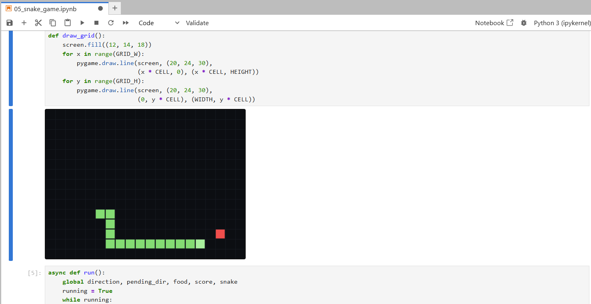

# ipygame

[](https://mybinder.org/v2/gh/Kamuyin/ipygame/master?urlpath=lab)

ipygame is a pygame-style API for writing small games inside Jupyter notebooks, primarily for teaching and classroom use. Instead of SDL2, it renders to an `ipycanvas` canvas output, so it works in environments where you do not have a desktop window (e.g. JupyterLab, hosted JupyterHub).



The goal is API familiarity, not perfect drop-in compatibility. Many common drawing and event patterns work, but the browser and the widget stack impose limits.

## Install

For local notebooks (CPython kernels), install from this repository:

```bash
pip install git+https://github.com/Kamuyin/ipygame.git
```

## Quick start

```python
import ipygame as pygame

screen = pygame.display.set_mode((420, 260))
screen.fill("midnightblue")
pygame.draw.rect(screen, "gold", (30, 30, 140, 80))
pygame.draw.circle(screen, "tomato", (280, 130), 50)
pygame.display.flip()
```

## Examples

The [examples/](examples/) folder contains notebooks for basic drawing, input handling, and small game demos.

## Documentation

Docs and API reference: <https://kamuyin.github.io/ipygame>

## Limitations and known issues

Some pygame features are not applicable in the browser or are not implemented yet. For a high-level view of what is currently covered, check the API coverage page in the docs.

Performance can be noticeably lower than desktop pygame. Rendering happens through the browser canvas and a widget message channel, so high-FPS loops and pixel-heavy effects pay extra overhead, and there is no native SDL2 window/GPU pipeline like on the desktop.

If you run the examples in JupyterLite (Pyodide), you may see rendering work while real-time keyboard/mouse input does not. This is a limitation of the Pyodide kernel + widget message processing for long-running loops, and it is not something ipygame can reliably fix from Python alone.

Audio is work in progress.

## Acknowledgements

ipygame is based on the work by the pygame and pygame-ce projects and aims to provide a familiar API for educational notebooks. This project is not affiliated with, endorsed by, or a replacement for pygame/pygame-ce.

## License

Licensed under the GNU Lesser General Public License v2.1 (LGPL-2.1-only). See [LICENSE](LICENSE).
